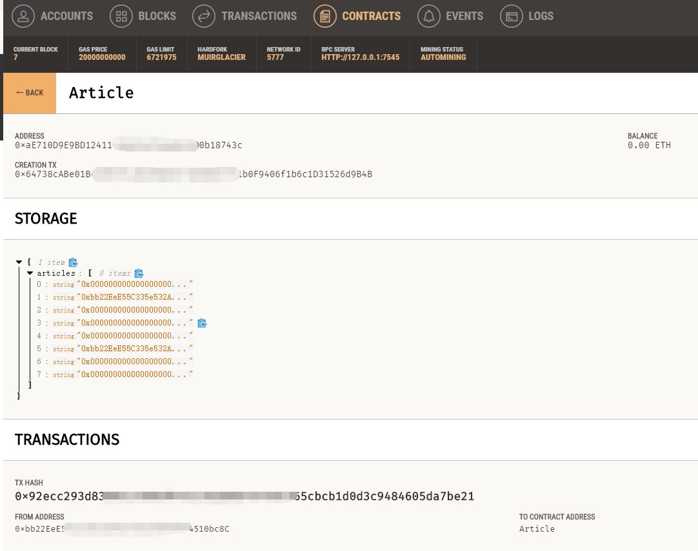

# dao-rookie


智能合约的极简案例


本文用最少的内容讲述智能合约


技术栈——
- Vue3
- ethers.js
- solidity
- Ganache
- truffle


## Ganache


因为区块链的操作如果在线上，每一个合约都需要消耗**GAS**(手续费)，所以需要创建一个虚拟环境


> 官网地址
> https://trufflesuite.com/ganache/


## solidity


智能合约是现在**区块链**技术的一个关键点


> 官网地址
> https://soliditylang.org/


`/contracts`目录下放置的是`.sol`的智能合约


定义一个`address`**数组**的公共成员变量`articles`，对应8篇文章


然后`verify`方法中入参为数组id，保存用户的地址，代表这个用户审核了这个文章


```sol
pragma solidity ^0.8.0;

contract Article {
  address[8] public articles;  // 文章
    // 审核
  function verify(uint id) public returns (uint) {
    require(id >= 0 && id < 8);  // 确保id在数组长度内
    articles[id] = msg.sender;        // 保存调用这地址
    return id;
  }
  // 返回文章审核状态
  function getArticles() public view returns (address[8] memory) {
    return articles;
  }
}
```


## truffle


**合约**需要**部署**到**服务器**(Ganache)，需要用到Turffle


> 官网地址
> https://trufflesuite.com


使用**NPM**安装


> 如果不懂NPM那么先了解Node
> https://nodejs.org


```bash
npm install -g truffle
```


编译后可以部署到ganache服务器


```bash
truffle compile
truffle deploy
```


可以在`Ganache`的`CONTRACTS`下看到部署的合约，各种参数以及交易记录都可以看到


合约地址`ADDRESS`非常有用，之后调用需要





并且还会生成*json*文件


```json
{
  "contractName": "Article",
  "abi": [
    {
      "inputs": [
        {
          "internalType": "uint256",
          "name": "",
          "type": "uint256"
        }
      ],
      "name": "articles",
      "outputs": [
        {
          "internalType": "address",
          "name": "",
          "type": "address"
        }
      ],
      "stateMutability": "view",
      "type": "function",
      "constant": true
    },
    {
      "inputs": [
        {
          "internalType": "uint256",
          "name": "id",
          "type": "uint256"
        }
      ],
      "name": "verify",
      "outputs": [
        {
          "internalType": "uint256",
          "name": "",
          "type": "uint256"
        }
      ],
      "stateMutability": "nonpayable",
      "type": "function"
    },
    {
      "inputs": [],
      "name": "getArticles",
      "outputs": [
        {
          "internalType": "address[8]",
          "name": "",
          "type": "address[8]"
        }
      ],
      "stateMutability": "view",
      "type": "function",
      "constant": true
    }
  ],

……

}
```


## Vue3


国内的前端开发者，使用**Vue**的比较多，使用前端框架，开发可以更迅速


> 官网地址
> https://vuejs.org/


使用了**pinia**作为数据处理


> 官网地址
> https://pinia.vuejs.org/


## ethers.js


**ethers.js**比**web.js**强在**typescript**的支持，并且更加简洁


> 官网地址
> https://ethers.io


这时候，要用到**truffe**工具**deploy**的*address*和*json*文件，就可以完成合约操作


```js
import { ethers } from "ethers"; // 加载ethers
const provider = new ethers.providers.Web3Provider(window.ethereum); // 构建provider
await provider.send("eth_requestAccounts", []); // 连接metamask
const contract = new ethers.Contract(address, abi, provider.getSigner()); // 使用合约address以及json中的abi
const arr = await contract.getArticles()
```